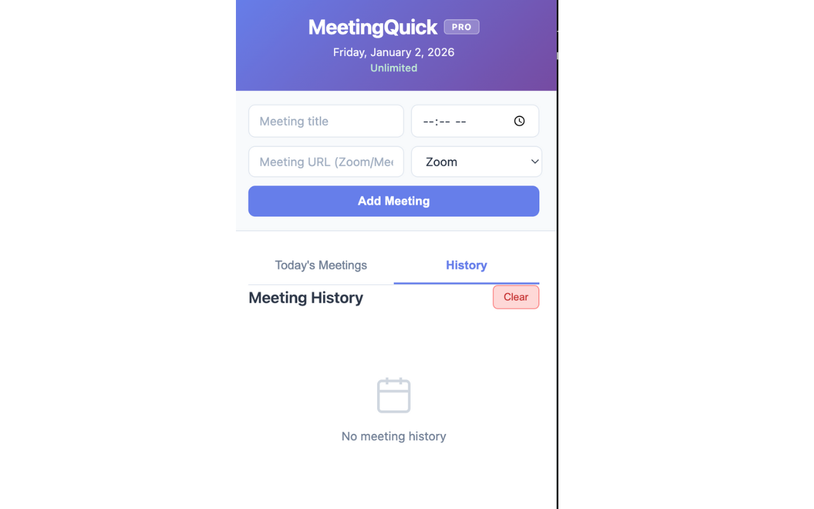

# MeetingQuick - Chrome Extension

## Overview

MeetingQuick is a productivity Chrome extension that helps you manage your meetings efficiently with one-click join links, meeting templates, and time tracking features.

## Features

- **Quick Join**: One-click access to your frequently used meeting links
- **Meeting Templates**: Save time with pre-configured meeting settings  
- **Time Tracking**: Monitor time spent in meetings
- **Clean Interface**: Modern, intuitive UI for seamless user experience

## Screenshots

### Free Plan View

*Choose the plan that fits your needs*

### Meeting History

*Track all your past meetings in one place*

### Today's Meetings

*Quick access to today's scheduled meetings*

## Technologies Used

- JavaScript
- Chrome Extension APIs
- HTML5 & CSS3
- Local Storage API

## Installation

### From Chrome Web Store
Available on the Chrome Web Store [add link when published]

### Manual Installation
1. Download this repository
2. Open Chrome and go to `chrome://extensions/`
3. Enable "Developer mode" (toggle in top-right)
4. Click "Load unpacked"
5. Select the MeetingQuick folder

## How to Use

1. Click the MeetingQuick icon in your Chrome toolbar
2. Add your frequently used meeting links
3. Click any saved link to instantly join meetings
4. Create templates for recurring meetings

## Development

Built using AI-assisted development methodology - a collaborative approach combining human creativity with AI capabilities.

## Author

**Kiwo Jumbam**
- Portfolio: https://portfolio-website-c3ee.vercel.app/
- LinkedIn: [linkedin.com/in/kiwo-jumbam-80ab6537b](https://www.linkedin.com/in/kiwo-jumbam-80ab6537b/)
- Email: kjumbam@yahoo.com

---

Star this repo if you find it helpful!

